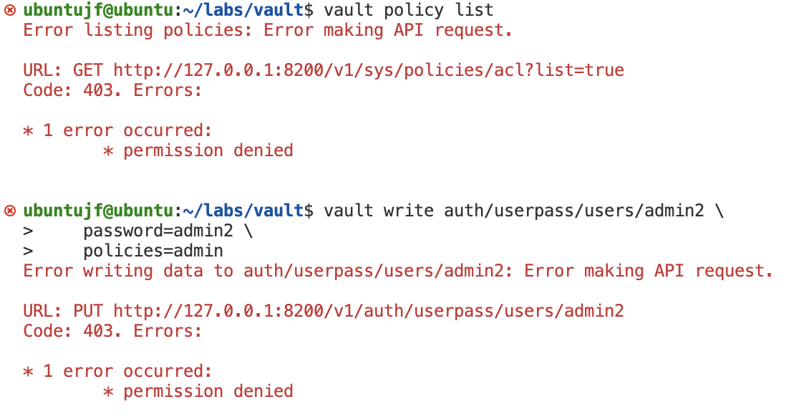

Jean-François Pasche  
Octobre 2022   
# CAA 22-23 : Lab #1
Ce rapport contient les réponses aux questions posées dans la consigne du laboratoire.  
Des explications sur les scripts fournies dans le readme.

## 4.1. What is the goal of the unseal process. Why are they more than one unsealing key?
Ce processus permet de reconstituer la clef *root* qui permet de déchiffrer la clef qui chiffre les données du *vault*.    
La clef *root* est générée lors de l'initialisation du vault ou lors d'une opération de *rekey*. Elle est divisée en plusieurs fragments grâce à l'algorithme `shamir`. Le nombre de fragments nécessaires à la reconstitution de la clef *root* peut être défini lors de l'initialisation.  
Dans notre cas, on génère 6 fragments et 2 d'entre-eux sont nécessaires pour le déverrouillage. Ces fragments ne sont pas sensés se trouver au même endroits. Il doivent être stockés complètement séparément et contrôlés par des personnes différentes. Ainsi, si un malandrin venait à récupérer l'un d'eux, il serait incapable d'exécuter le *unseal process*.

## 4.2. What is a security officer. What do you do if one leaves the company?
Un *security officer* est le possesseur d'un fragment de clef. S'il quitte la compagnie, il faudra alors effectuer une opération de *rekey*, qui consiste à regénérer une clef root et sa fragmentation avec `shamir`.

## 6.1. Why is it recommended to store the root certificate private key outside of Vault (we did not do this here)?
Car ce certificat est auto-signé et non révoquable. De ce fait, il doit être particulièrement bien protégé. Toute la sécurité de la PKI repose sur lui. Si un malandrin se la procure, il peut signer tous les certificats qu'il veut. Le seul moyen d'arrêter son action serait alors de retirer manuellement le certificat root signé avec la clef qui a fuité partout où il est utilisé.

## 6.2. Where would you typically store the root certificate private key?
La clef privée du certificat peut typiquement être gérée par un HSM, voire plusieurs HSM, ou alors être séparée en plusieurs morceaux stockés séparément dans différents emplacements sûrs, tels des coffres forts.

## 6.3. How would you implement this?
Je me servirais d'un HSM pour gérer la clef. Cette dernière serait donc générée par le device et n'en sortirait jamais. Ce HSM serait stocké dans un coffre fort. Il n'en serait sorti que dans la nécessité de signer le certificat d'une autorité intermédiaire.

La commande suivante permet de générer une CSR pour le certificat root:
```bash
vault write -field=certificate pki/root/generate/exported \
     common_name="heig-vd.ch Root" \
     issuer_name="heig-vd-root-2022" \
     ttl=87600h > heig-vd_root_ca.crt
```
> Par rapport à la commande utilisée dans le lab, `internal` est remplacé par `exported` à la fin du chemin.

Il faudrait ensuite demander au HSM de signer la CSR et importer le certificat signé dans `vault`.

## 6.4. How are the CRLs managed? How do you revoke a certificate (give the command)?
Il y a la possibilité d'activer une route qui permet de récupérer la liste de révovation. Les utilisateurs de la PKI pourront alors facilement vérifier quels certificats s'y trouvent.  
Pour activer cett route, exécuter la commande :
```bash
vault write pki/config/urls \
     crl_distribution_points="$VAULT_ADDR/v1/pki/crl"
```
Pour révoquer un certificat, exécuter la commande :
```bash
vault write pki_int/revoke serial_number=<serial_number>
```

## 7. What appends if we try doing admin tasks with the toto user ? Show a screenshot.



## 8.1. How is the root key and the encryption key used to secure Vault?
La clef root (*root key*) est celle qui est divisée en fragments avec `shamir`. La clef de chiffrement (*encryption key*) est quant à elle utilisée pour chiffrer les données en elles-mêmes. Cette dernière est elle-mêmme chiffrée avec la clef *root*. La *root key* est reconstituée avec le *unseal process*. Elle permet ensuite de déchiffrer la clef de chiffrement, qui permet enfin de déchiffrer les données contenues dans `vault`.
[Ce lien](https://www.vaultproject.io/docs/concepts/seal) renvoie vers la documentation officielle.

## 8.2. What is key rotation and when is it done?
Dans `vault`, la rotation de clef (*key rotation*) est le processus qui permet de changer de clef de chiffrement. `vault` suit les recommandations du NIST en effectant automatiquement une rotation de clef tous les 2<sup>32</sup> chiffrements depuis la version 1.7. Il est cependant possible de le faire manuellement.  
Lorsque la rotation est effectuée, l'ancienne clef est toujours utilisée pour les données qu'elle a chiffré. Seules les nouvelles données sont chiffrées avec la nouvelle clef.         

## 8.3. What can you say about the confidentiality of data in the storage backend? How is it done?
Les données dans le backend sont chiffrées avec AES-256-GCM. A noter que `vault` chiffre les données [résidentes en mémoire](https://www.hashicorp.com/blog/how-vault-encrypts-application-data-during-transit-and-at-rest), afin de garrantir au mieux la confidentialité.  
[Ce lien](https://www.vaultproject.io/docs/internals/rotation) redirige vers la documentation officielle.

## 8.4. What can you say about the security of Vault against an adversary that analyses the memory of the server that runs Vault?
Les données résidentes en mémoire sont chiffrées. Cependant, si un adversaire parvenait à faire un dump complet de la mémoire, il devrait pouvoir retrouver la clef de chiffrement, et donc déchiffrer toutes les données. Dans sa documentation officielle, `vault` précise que la protection contre l'analyse de la mémoire ne fait pas partie de leur [modèle de menace](https://developer.hashicorp.com/vault/docs/internals/security).